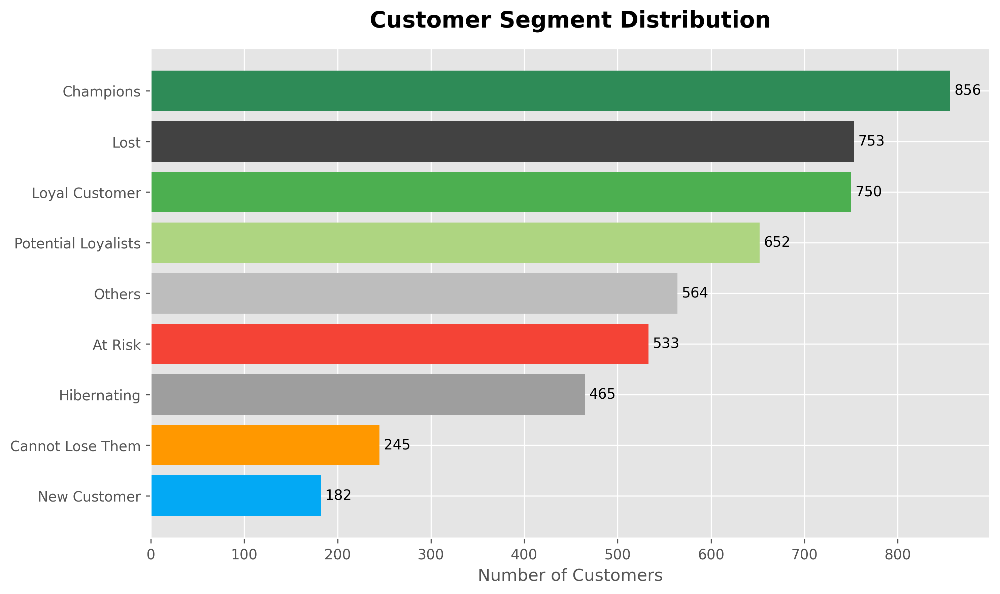
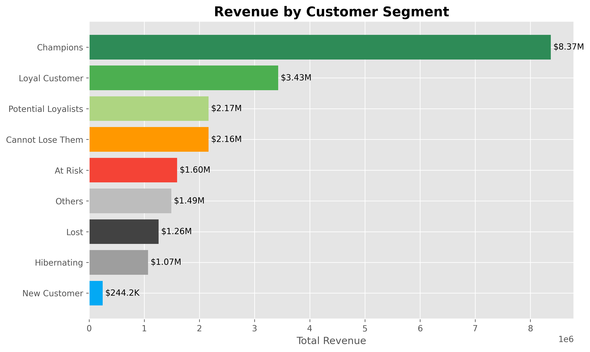
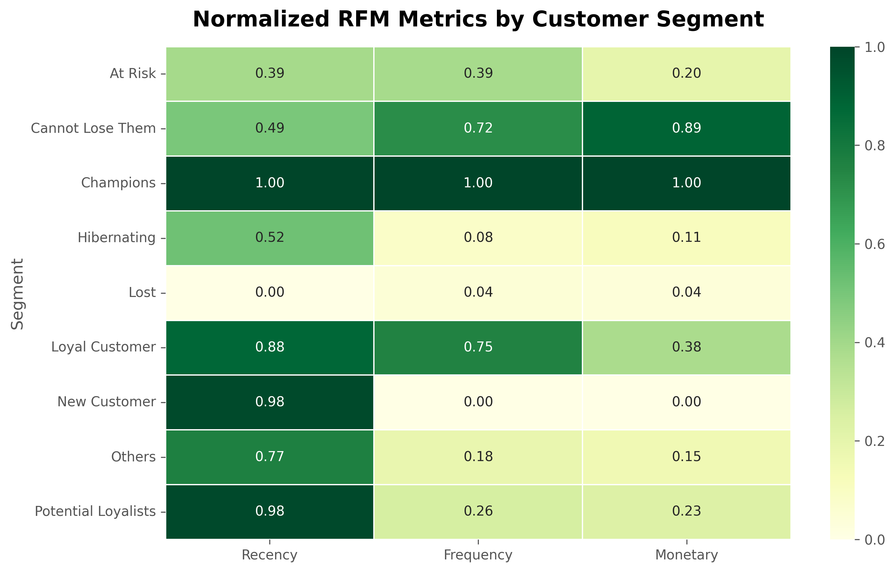
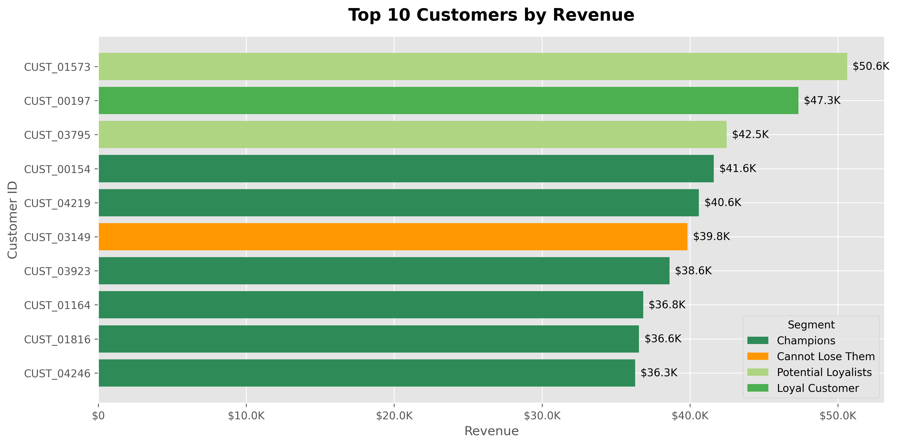
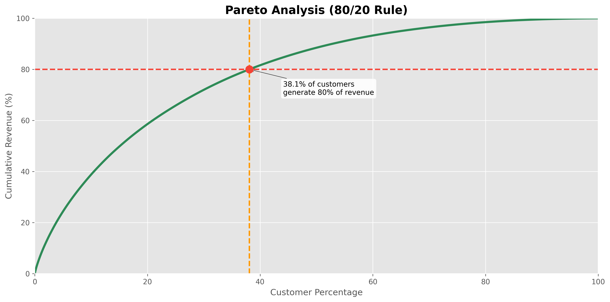

# 🛒 E-Commerce Customer Segmentation using RFM Analysis

## 📌 Project Overview

This project analyzes customer purchasing behavior using **RFM (Recency, Frequency, Monetary) Analysis** to segment customers into meaningful business groups and provide actionable marketing recommendations.

The project follows a complete data analytics workflow, from data cleaning to business recommendations.

---

## 📊 Dashboard Preview

### Customer Segment Distribution



### Revenue by Segment



### RFM Heatmap



### Top Customers



### Pareto Analysis



---

## 🎯 Objectives

- Analyze customer purchasing behavior
- Build RFM-based customer segments
- Identify high-value and at-risk customers
- Create business-oriented KPI dashboards
- Generate actionable marketing recommendations

---

## 📂 Project Structure

```
01_Data_Understanding.ipynb
02_Data_Cleaning.ipynb
03_EDA.ipynb
04_RFM_Analysis.ipynb
05_Customer_Segmentation.ipynb
06_KPI_Dashboard.ipynb
07_Business_Recommendations.ipynb
```

---

## 🛠️ Technologies Used

- Python
- Pandas
- NumPy
- Matplotlib
- Seaborn

---

## 📊 Customer Segments

- Champions
- Loyal Customers
- Potential Loyalists
- New Customers
- Cannot Lose Them
- At Risk
- Hibernating
- Lost
- Others

---

## 📈 Dashboard Highlights

The dashboard includes:

- KPI Overview
- Customer Segment Distribution
- Revenue by Segment
- RFM Heatmap
- Top Customers Analysis
- Pareto (80/20) Analysis

---

## 💡 Business Value

The final output translates customer insights into practical business strategies, helping companies:

- Improve customer retention
- Reduce customer churn
- Increase customer lifetime value
- Optimize marketing campaigns
- Support data-driven decision making

---

## Installation

```bash
git clone <repository-url>

cd Ecommerce-Customer-Analysis

python -m venv custenv

custenv\Scripts\activate

python -m pip install -r requirements.txt
```

---

## 🚀 Author

**Kimiya Jamshidi**
